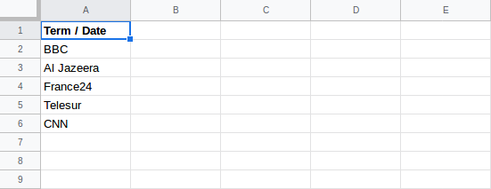

## Google Trends Scraper

Google Trends Scraper is an [Apify actor](https://apify.com/actors) for extracting data from [Google Trends](https://trends.google.com/trends) web site. Currently it scrapes only *Interest over time* data. It is build on top of [Apify SDK](https://sdk.apify.com/) and you can run it both on [Apify platform](https://my.apify.com) and locally.

- [Input](#input)
- [Output](#output)
- [Authorization](#authorization)
- [Custom time range](#custom-time-range)
- [Extend output function](#extend-output-function)
- [Open an issue](#open-an-issue)

### Input

| Field | Type | Description |
| ----- | ---- | ----------- |
| searchTerms | array | (Required if 'spreadsheetId' is not provided) List of search terms to be scraped. |
| spreadsheetId | string | (Optional) Id of the google sheet from where search terms will be loaded. |
| isPublic | boolean | If checked you can import a public spreadsheet without need for authorization. For importing private sheets, please read about authorization below. Defaults to `false`. |
| timeRange | string | Choose a predefined search's time range (defaults to 'Past 12 months') |
| category | string | Choose a category to filter the search for (defaults to 'All categories') |
| maxItems | number | (optional) Maximum number of product items to be scraped |
| customTimeRange | string | Provide a custom time range. If provided, it takes precedence over regular timeRange. Read [Custom time range](#custom-time-range) for correct format and examples. |
| extendOutputFunction | string | (optional) Function that takes a JQuery handle ($) as argument and returns data that will be merged with the default output. More information in [Extend output function](#extend-output-function) |
| proxyConfiguration | object | (optional) Proxy settings of the run. If you have access to Apify proxy, leave the default settings. If not, you can set `{ "useApifyProxy": false" }` to disable proxy usage |

**Notes on the input as a spreadsheet**
- The only spreadsheet allowed is a Google sheet.
- Spreadsheet must have only one column.
- The first row of the spreadsheet is considered the title of the column so it will not be loaded as a search term.

Google sheet example:



**Notes on timeRange**\
On the Apify platform you can choose the time range from a select menu. 
If you provide the INPUT as JSON, these are the `timeRange` possible values:\
\
`now 1-H` (equals to Past hour)\
`now 4-H` (equals to Past 4 hours)\
`now 1-d` (equals to Past day)\
`now 7-d` (equals to Past 7 days)\
`today 1-m` (equals to Past 30 days)\
`today 3-m` (equals to `Past 90 days`)\
`''` (empty string equals to Past 12 months. It's the default)\
`today 5-y` (equals to Past 5 years)\
`all` (equals to 2004-present)

**INPUT Example:**

```
{
  "searchTerms": [
    "test term",
    "another test term"
  ],
  "spreadsheetId": spreadsheetId,
  "timeRange": "now 4-H", 
  "isPublic": true,
  "maxItems": 100,
  "customTimeRange": "2020-03-24 2020-03-29",
  "extendOutputFunction": "($) => { return { test: 1234, test2: 5678 } }",
  "proxyConfiguration": {
    "useApifyProxy": true
  }
}
```

### Authorization

Authorization is needed only if your Google sheet is private.
Google Trends Scraper internally runs [Google Sheets Import & Export actor](https://apify.com/lukaskrivka/google-sheets#authentication-and-authorization). The authorization process needs to be done running this actor separately in your account. After running it one time, the actor will save a token in your KV store and Google Trends Scraper will use it automatically. This means that after running [Google Sheets Import & Export actor](https://apify.com/lukaskrivka/google-sheets#authentication-and-authorization) one time, you can fully automate the Google Trends Scraper actor without thinking about authorization anymore.

Please check this [article](https://help.apify.com/en/articles/2424053-google-integration) for instructions on how to authorize using [Google Sheets Import & Export actor](https://apify.com/lukaskrivka/google-sheets#authentication-and-authorization).

If you want to use more spreadsheets from different Google accounts, then each Google account needs to have a different tokensStore. You need to track which tokens belong to which account by naming the store properly.

### Output

Output is stored in a dataset.
Each item will contain the search term and all values keyed by the corresponding date.

Example of one output item:
```
{
  "searchTerm": "CNN",
  "‪Jan 13, 2019‬": 92,
  "‪Jan 20, 2019‬": 100,
  "‪Jan 27, 2019‬": 86,
  "‪Feb 3, 2019‬": 82,
  ...
}
```

You may download the output as a nicely formatted spreadsheet from the *dataset* tab of your actor run.

### Custom time range
Custom time range is a string with the following order:\
`startDate endDate`\
And the following format:\
`YYYY-MM-DD YYYY-MM-DD`

Examples:
```
2020-01-30 2020-03-29
```
```
2019-03-20 2019-03-26
```

Only when the range is up to 7 days, each date supports the time as well. 
Examples:
```
2020-03-24T08 2020-03-29T15
```

### Extend output function

You can use this function to update the default output of this actor. This function gets a JQuery handle `$` as an argument so you can choose what data from the page you want to scrape. The output from this will function will get merged with the default output.

The **return value** of this function has to be an **object**!

You can return fields to achieve 3 different things:
- Add a new field - Return object with a field that is not in the default output
- Change a field - Return an existing field with a new value
- Remove a field - Return an existing field with a value `undefined`

The following example will add a new field:
```
($) => {
    return {
        comment: 'This is a comment',
    }
}
```

### Open an issue
If you find any bug, please create an issue on the actor [Github page](https://github.com/emastra/actor-google-trends-scraper).
